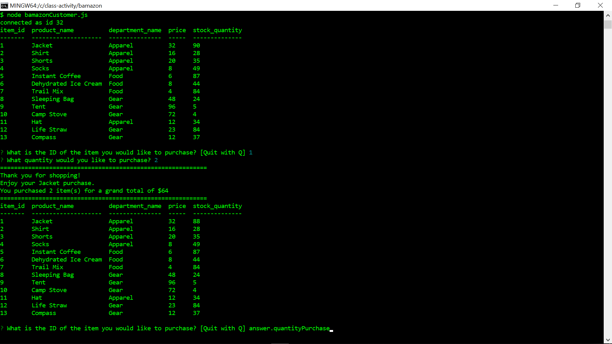
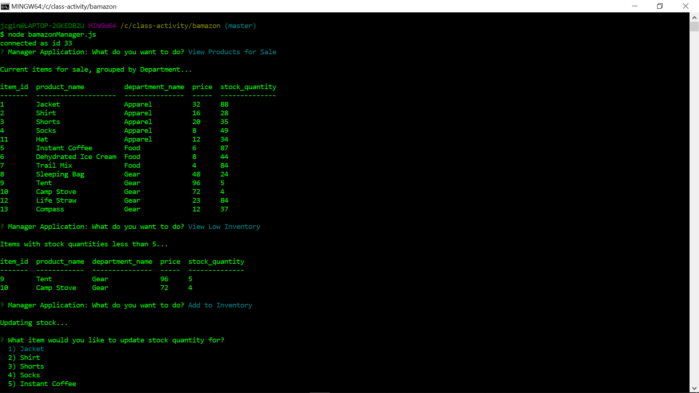

# bamazon

This ia an Amazon-like storefront -- bamazon. The Customer program app (bamazonCustomer.js) will take in orders from customers and deplete stock from the store's inventory. A  Manager program app (bamazonManager.js) allows for inventory management and product additions. This uses MySQL database functions.

## Getting Started

This app requires the MySQL, Inquirer and console.table npm packages :

   * [mysql](https://www.npmjs.com/package/mysql)

   * [inquirer](https://www.npmjs.com/package/inquirer)

   * [console.table](https://www.npmjs.com/package/console.table)
   

### Deployment
* Clone repo
* Run npm install
* At command prompt run 'node bamazonCustomer.js' and 'node bamazonManager.js' further instructions below

# Instructions

## bamazonCustomer

* Based on a SQL Database called `bamazon`.

* A "products" table populated with products with the following details:

   * item_id (unique id for each product)

   * product_name (Name of product)

   * department_name

   * price (cost to customer)

   * stock_quantity (how much of the product is available in stores)

* Running this application will first display all of the items available for sale. Including the ids, names, and prices of products for sale. Then prompts users with two messages.

   * The first asks the ID of the product they would like to buy.
   * The second message asks how many units of the product they would like to buy.

* Once the customer has placed the order, the application will check if the store has enough of the product to meet the customer's request.

   * If not, the app logs a phrase like `Insufficient quantity!`, and then prevents the order from going through.

* However, if your store _does_ have enough of the product, it will fulfill the customer's order.
   * This means updating the SQL database to reflect the remaining quantity.
   * Once the update goes through, shows the customer the total cost of their purchase.
   
### Issues
 
This was pretty straightforward based on in-class exercises. I had difficulty using console.table -- I was overthinking it.  It ended up being very easy to use.  I had everything working, but decided to add the Quit functiion shown in the demo. What seemed like a small thing became a big job. I ended up re-writing and pulling apart the code several times. I became very adept at using console.log and got it working successfully. Feeling confident -- I decided to take on the next level: bamazonManager.

## bamazonManager

* Running this application will:

  * List a set of menu options:

    * View Products for Sale
    
    * View Low Inventory
    
    * Add to Inventory
    
    * Add New Product

  * If a manager selects `View Products for Sale`, the app will list every available item: the item IDs, names, prices, and quantities.

  * If a manager selects `View Low Inventory`, the app will list all items with an inventory count lower than five.

  * If a manager selects `Add to Inventory`, the app will display a prompt that will let the manager "add more" of any item currently in the store.

  * If a manager selects `Add New Product`, the app will allow the manager to add a completely new product to the store.

### Issues
Once again, the in-class assignments prepared me well for this activity. I like this project in that I could create a basic framework and then go in and feel in the pieces. I started with the inquirer prompts then created placeholders for the functions.  I started with the easiest -- the display. Then I worked on adding a product wbich was easily transferable from the Great Bay activity.  I did a little research to make the low inventory work. This had me revisit the Top 5000 activity. Unfortunately, I burned alot of time on the inventory update. While it seemed like it should have been easily transferable from the Great Bay activity -- I could not get the database to update the stock quantity. I ended up doing research and found a solution that worked. If the syntax looks different than what we covered, I have attached a link below.  Spent a lot of time fixing little things -- no time or energy to take on the Supervisor challenge.

## Built With

* [JavaScript]
* [MySQL created using MySQL Workbench]

## Authors

* **Jennifer Ginelli** - *Initial work* - [jcnimble](https://jcnimble.github.io/)

## Acknowledgments

   * UPENN201903FSF4-FT/12-mysql/01-Activities/10-GreatBay/Solved/
   * UPENN201903FSF4-FT/12-mysql/01-Activities/13-Top5000Code/Solved/
   * https://www.sitepoint.com/using-node-mysql-javascript-client/
   * Bryan esteemed Professor
   * Buzz and Aaron dedicated TAs
